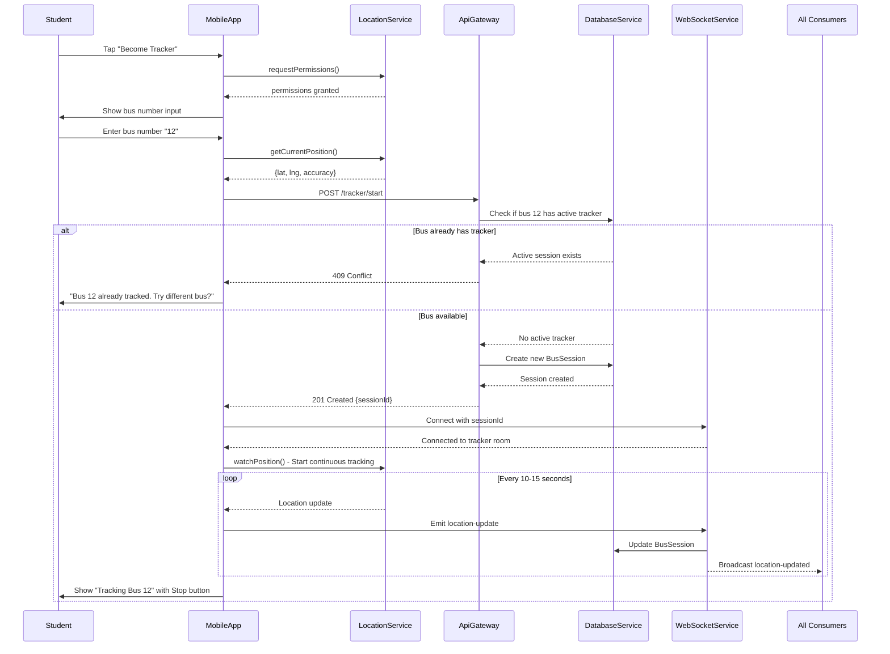
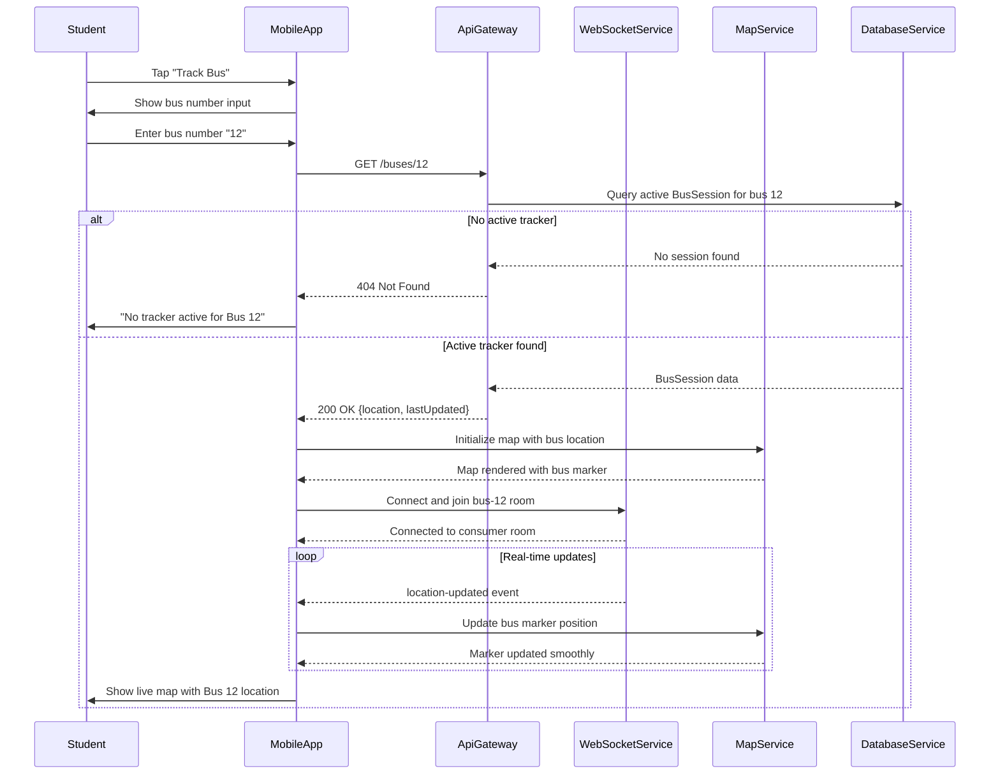

# Core Workflows

## Workflow 1: Student Becomes Bus Tracker

```mermaid
sequenceDiagram
    participant Student
    participant MobileApp
    participant LocationService
    participant ApiGateway
    participant DatabaseService
    participant WebSocketService
    
    Student->>MobileApp: Tap "Become Tracker"
    MobileApp->>LocationService: requestPermissions()
    LocationService-->>MobileApp: permissions granted
    
    MobileApp->>Student: Show bus number input
    Student->>MobileApp: Enter bus number "12"
    
    MobileApp->>LocationService: getCurrentPosition()
    LocationService-->>MobileApp: {lat, lng, accuracy}
    
    MobileApp->>ApiGateway: POST /tracker/start
    ApiGateway->>DatabaseService: Check if bus 12 has active tracker
    
    alt Bus already has tracker
        DatabaseService-->>ApiGateway: Active session exists
        ApiGateway-->>MobileApp: 409 Conflict
        MobileApp->>Student: "Bus 12 already tracked. Try different bus?"
    else Bus available
        DatabaseService-->>ApiGateway: No active tracker
        ApiGateway->>DatabaseService: Create new BusSession
        DatabaseService-->>ApiGateway: Session created
        ApiGateway-->>MobileApp: 201 Created {sessionId}
        
        MobileApp->>WebSocketService: Connect with sessionId
        WebSocketService-->>MobileApp: Connected to tracker room
        
        MobileApp->>LocationService: watchPosition() - Start continuous tracking
        loop Every 10-15 seconds
            LocationService-->>MobileApp: Location update
            MobileApp->>WebSocketService: Emit location-update
            WebSocketService->>DatabaseService: Update BusSession
            WebSocketService-->>All Consumers: Broadcast location-updated
        end
        
        MobileApp->>Student: Show "Tracking Bus 12" with Stop button
    end
```

## Workflow 2: Student Tracks Bus Location

```mermaid
sequenceDiagram
    participant Student
    participant MobileApp
    participant ApiGateway
    participant WebSocketService
    participant MapService
    participant DatabaseService
    
    Student->>MobileApp: Tap "Track Bus"
    MobileApp->>Student: Show bus number input
    Student->>MobileApp: Enter bus number "12"
    
    MobileApp->>ApiGateway: GET /buses/12
    ApiGateway->>DatabaseService: Query active BusSession for bus 12
    
    alt No active tracker
        DatabaseService-->>ApiGateway: No session found
        ApiGateway-->>MobileApp: 404 Not Found
        MobileApp->>Student: "No tracker active for Bus 12"
    else Active tracker found
        DatabaseService-->>ApiGateway: BusSession data
        ApiGateway-->>MobileApp: 200 OK {location, lastUpdated}
        
        MobileApp->>MapService: Initialize map with bus location
        MapService-->>MobileApp: Map rendered with bus marker
        
        MobileApp->>WebSocketService: Connect and join bus-12 room
        WebSocketService-->>MobileApp: Connected to consumer room
        
        loop Real-time updates
            WebSocketService-->>MobileApp: location-updated event
            MobileApp->>MapService: Update bus marker position
            MapService-->>MobileApp: Marker updated smoothly
        end
        
        MobileApp->>Student: Show live map with Bus 12 location
    end
```
