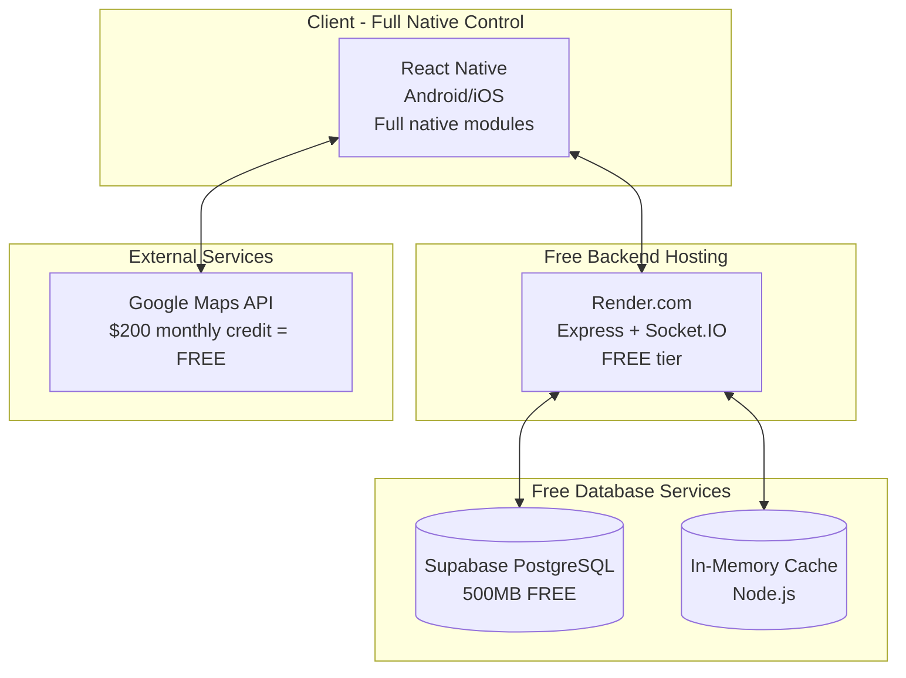

# High Level Architecture

## Technical Summary
The CVR College Bus Tracker employs a React Native mobile application with Node.js/Express backend in a real-time peer-to-peer architecture. The system uses WebSocket connections for live location broadcasting, PostgreSQL for structured data storage with TTL cleanup, and Redis for session management. The monorepo structure supports rapid single-developer iteration while the cloud deployment (Render.com) provides auto-scaling for academic period usage spikes with completely free hosting. This architecture achieves the PRD's core goal of eliminating transportation uncertainty through reliable real-time tracking with minimal infrastructure complexity.

## Platform and Infrastructure Choice

**Platform:** Render.com (Free Tier)
**Key Services:** Free web service hosting, PostgreSQL via Supabase (free), Redis via in-memory caching
**Deployment Host and Regions:** Auto-assigned (US-based)

**Rationale:** Optimized for zero-cost deployment while maintaining professional-grade architecture capable of handling 200-300 concurrent users as specified in PRD requirements.

## Repository Structure

**Structure:** Monorepo with Yarn Workspaces
**Monorepo Tool:** Yarn Workspaces (simpler than Nx for this scale)
**Package Organization:** Apps (mobile, backend), Packages (shared-types, utils, config)

## High Level Architecture Diagram

## Architectural Patterns
- **Traditional Server Architecture:** Single Express.js server for simplicity and cost efficiency - _Rationale:_ Handles academic period traffic efficiently while remaining completely free to deploy
- **WebSocket Real-time:** Socket.IO for location broadcasting with room-based distribution - _Rationale:_ Ensures sub-second location updates for real-time tracking experience
- **Component-Based Mobile:** React Native CLI with TypeScript and reusable components - _Rationale:_ Cross-platform development with full native access, no Expo limitations
- **Repository Pattern:** Abstract data access behind service interfaces - _Rationale:_ Enables testing and potential database migration flexibility
- **Session-Based Tracking:** In-memory sessions for tracker state without persistent user data - _Rationale:_ Meets privacy requirements while maintaining reliable tracker management
- **TTL Data Management:** PostgreSQL TTL cleanup for automatic location data cleanup - _Rationale:_ Ensures 24-hour data retention requirement with zero maintenance overhead
